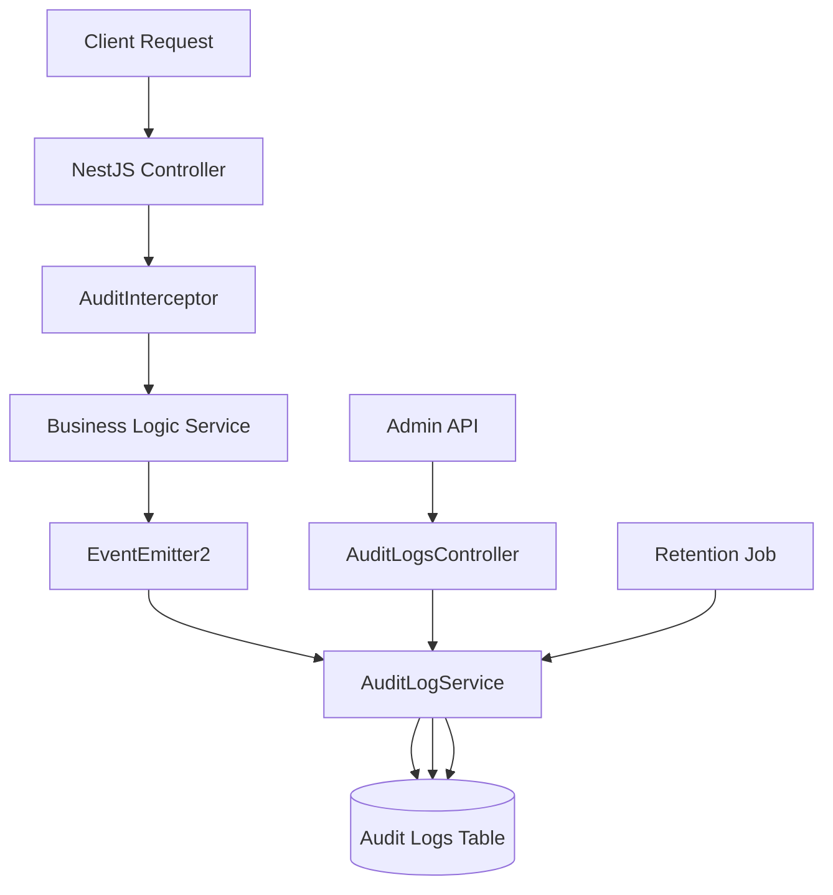
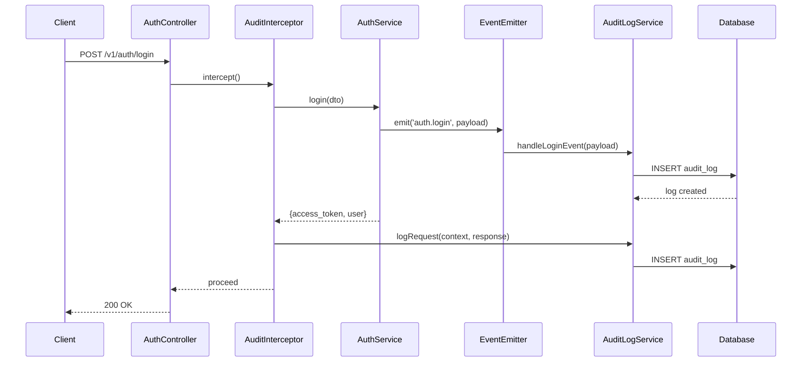
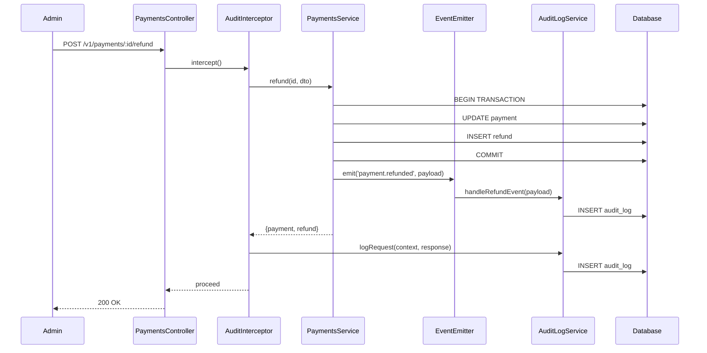
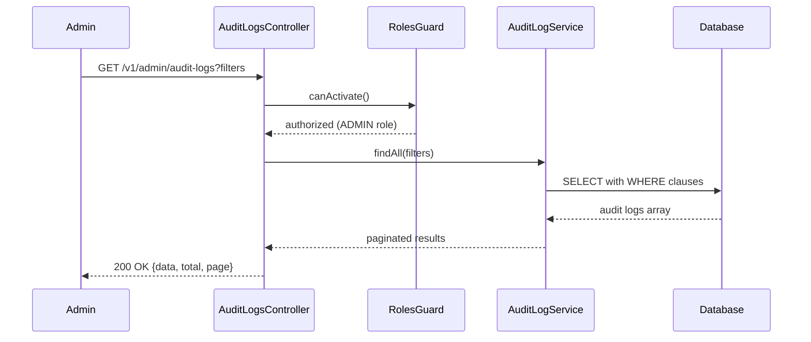

# Design Document: Audit Log System

## Overview

The audit log system provides immutable tracking of all sensitive operations across the FacilPay API for compliance, security, and debugging purposes. The system captures authentication events (login, logout), payment operations (creation, refunds, cancellations), API key lifecycle events (create, revoke), and account security changes (password changes). All audit logs are append-only with configurable retention policies and support comprehensive filtering for administrative review.

The design leverages NestJS interceptors for transparent request-level auditing and EventEmitter2 for domain event-driven logging. Logs are stored in a dedicated immutable table with indexed fields for efficient querying. The admin API endpoint provides paginated access with filtering by actor, action type, resource, IP address, and time range.

## Architecture



## Sequence Diagrams

### Login Event Audit Flow




### Payment Refund Audit Flow



### Admin Query Audit Logs Flow



## Components and Interfaces

### Component 1: AuditLog Entity

**Purpose**: Immutable domain entity representing a single audit log entry

**Interface**:
```typescript
@Entity('audit_logs')
export class AuditLog {
  @PrimaryGeneratedColumn('uuid')
  id: string;

  @Column({ type: 'uuid', nullable: true })
  actorId: string | null;

  @Column({ type: 'varchar', length: 100 })
  actorType: 'user' | 'api_key' | 'system';

  @Column({ type: 'varchar', length: 100 })
  action: AuditAction;

  @Column({ type: 'varchar', length: 100 })
  resourceType: string;

  @Column({ type: 'uuid', nullable: true })
  resourceId: string | null;

  @Column({ type: 'inet', nullable: true })
  ipAddress: string | null;

  @Column({ type: 'varchar', length: 255, nullable: true })
  userAgent: string | null;

  @Column({ type: 'jsonb', nullable: true })
  metadata: Record<string, any> | null;

  @CreateDateColumn()
  timestamp: Date;
}
```

**Responsibilities**:
- Store immutable audit log data
- Provide indexed fields for efficient querying
- Support JSONB metadata for flexible additional context


### Component 2: AuditLogService

**Purpose**: Core service for creating and querying audit logs

**Interface**:
```typescript
@Injectable()
export class AuditLogService {
  log(params: CreateAuditLogParams): Promise<AuditLog>;
  findAll(filters: AuditLogFilters): Promise<PaginatedResult<AuditLog>>;
  deleteOlderThan(retentionDays: number): Promise<number>;
  handleLoginEvent(event: LoginEvent): Promise<void>;
  handleLogoutEvent(event: LogoutEvent): Promise<void>;
  handlePaymentCreatedEvent(event: PaymentCreatedEvent): Promise<void>;
  handleRefundEvent(event: RefundEvent): Promise<void>;
  handleApiKeyCreatedEvent(event: ApiKeyCreatedEvent): Promise<void>;
  handleApiKeyRevokedEvent(event: ApiKeyRevokedEvent): Promise<void>;
  handlePasswordChangedEvent(event: PasswordChangedEvent): Promise<void>;
}
```

**Responsibilities**:
- Create audit log entries with validation
- Query audit logs with filters and pagination
- Handle domain events and convert to audit logs
- Execute retention policy deletions

### Component 3: AuditInterceptor

**Purpose**: NestJS interceptor for transparent HTTP request auditing

**Interface**:
```typescript
@Injectable()
export class AuditInterceptor implements NestInterceptor {
  intercept(context: ExecutionContext, next: CallHandler): Observable<any>;
  private shouldAudit(context: ExecutionContext): boolean;
  private extractActorInfo(request: Request): ActorInfo;
  private extractResourceInfo(context: ExecutionContext): ResourceInfo;
}
```

**Responsibilities**:
- Intercept HTTP requests matching audit criteria
- Extract actor, resource, and metadata from request context
- Log successful operations after response completion
- Skip auditing for non-sensitive endpoints

### Component 4: AuditLogsController

**Purpose**: Admin API endpoint for querying audit logs

**Interface**:
```typescript
@Controller('v1/admin/audit-logs')
@UseGuards(JwtAuthGuard, RolesGuard)
@Roles(UserRole.ADMIN)
export class AuditLogsController {
  @Get()
  findAll(@Query() filters: GetAuditLogsDto): Promise<PaginatedResult<AuditLog>>;
}
```

**Responsibilities**:
- Provide read-only access to audit logs
- Enforce admin role authorization
- Support filtering and pagination

### Component 5: AuditLogRetentionService

**Purpose**: Scheduled service for enforcing retention policies

**Interface**:
```typescript
@Injectable()
export class AuditLogRetentionService {
  @Cron('0 2 * * *') // Run daily at 2 AM
  handleRetentionPolicy(): Promise<void>;
}
```

**Responsibilities**:
- Delete audit logs older than configured retention period
- Log retention job execution statistics


## Data Models

### Model 1: AuditLog

```typescript
interface AuditLog {
  id: string;
  actorId: string | null;
  actorType: 'user' | 'api_key' | 'system';
  action: AuditAction;
  resourceType: string;
  resourceId: string | null;
  ipAddress: string | null;
  userAgent: string | null;
  metadata: Record<string, any> | null;
  timestamp: Date;
}
```

**Validation Rules**:
- `actorType` must be one of: 'user', 'api_key', 'system'
- `action` must be a valid AuditAction enum value
- `resourceType` must be non-empty string
- `ipAddress` must be valid IPv4 or IPv6 format (nullable)
- `timestamp` is automatically set on creation (immutable)
- No UPDATE or DELETE operations allowed

### Model 2: AuditAction Enum

```typescript
enum AuditAction {
  // Authentication
  LOGIN = 'auth.login',
  LOGOUT = 'auth.logout',
  LOGIN_FAILED = 'auth.login_failed',
  
  // Payments
  PAYMENT_CREATED = 'payment.created',
  PAYMENT_REFUNDED = 'payment.refunded',
  PAYMENT_CANCELLED = 'payment.cancelled',
  
  // API Keys
  API_KEY_CREATED = 'api_key.created',
  API_KEY_REVOKED = 'api_key.revoked',
  
  // Account Security
  PASSWORD_CHANGED = 'account.password_changed',
  TWO_FACTOR_ENABLED = 'account.2fa_enabled',
  TWO_FACTOR_DISABLED = 'account.2fa_disabled',
  
  // Admin Operations
  USER_DELETED = 'admin.user_deleted',
  USER_ROLE_CHANGED = 'admin.user_role_changed',
}
```

### Model 3: CreateAuditLogParams

```typescript
interface CreateAuditLogParams {
  actorId?: string | null;
  actorType: 'user' | 'api_key' | 'system';
  action: AuditAction;
  resourceType: string;
  resourceId?: string | null;
  ipAddress?: string | null;
  userAgent?: string | null;
  metadata?: Record<string, any> | null;
}
```

**Validation Rules**:
- `actorType` is required
- `action` is required
- `resourceType` is required
- All other fields are optional
- `metadata` should not contain sensitive data (passwords, tokens)

### Model 4: AuditLogFilters (GetAuditLogsDto)

```typescript
interface AuditLogFilters extends PaginationDto {
  actorId?: string;
  actorType?: 'user' | 'api_key' | 'system';
  action?: AuditAction;
  resourceType?: string;
  resourceId?: string;
  ipAddress?: string;
  from?: Date;
  to?: Date;
}
```

**Validation Rules**:
- All fields are optional
- `from` must be before `to` if both provided
- `page` must be >= 1
- `limit` must be between 1 and 100
- Date ranges should not exceed 90 days for performance


## Algorithmic Pseudocode

### Main Processing Algorithm: Log Creation

```typescript
ALGORITHM createAuditLog(params: CreateAuditLogParams)
INPUT: params containing actor, action, resource, IP, and metadata
OUTPUT: created AuditLog entity

BEGIN
  // Precondition checks
  ASSERT params.actorType IS NOT NULL
  ASSERT params.action IS NOT NULL
  ASSERT params.resourceType IS NOT NULL
  ASSERT params.resourceType.length > 0
  
  // Step 1: Validate IP address format if provided
  IF params.ipAddress IS NOT NULL THEN
    isValidIp ← validateIpAddress(params.ipAddress)
    ASSERT isValidIp = true
  END IF
  
  // Step 2: Sanitize metadata to prevent sensitive data leakage
  sanitizedMetadata ← NULL
  IF params.metadata IS NOT NULL THEN
    sanitizedMetadata ← removeKeysMatching(params.metadata, ['password', 'token', 'secret', 'key'])
  END IF
  
  // Step 3: Create audit log entity
  auditLog ← new AuditLog({
    actorId: params.actorId ?? NULL,
    actorType: params.actorType,
    action: params.action,
    resourceType: params.resourceType,
    resourceId: params.resourceId ?? NULL,
    ipAddress: params.ipAddress ?? NULL,
    userAgent: params.userAgent ?? NULL,
    metadata: sanitizedMetadata,
    timestamp: getCurrentTimestamp()
  })
  
  // Step 4: Persist to database (append-only)
  savedLog ← repository.save(auditLog)
  
  // Step 5: Log operation for monitoring
  logger.info({
    auditLogId: savedLog.id,
    action: savedLog.action,
    actorType: savedLog.actorType
  }, 'Audit log created')
  
  // Postconditions
  ASSERT savedLog.id IS NOT NULL
  ASSERT savedLog.timestamp IS NOT NULL
  ASSERT savedLog.action = params.action
  
  RETURN savedLog
END
```

**Preconditions:**
- `params.actorType` is one of: 'user', 'api_key', 'system'
- `params.action` is a valid AuditAction enum value
- `params.resourceType` is a non-empty string
- If `params.ipAddress` provided, it must be valid IPv4 or IPv6 format
- Database connection is available

**Postconditions:**
- Returns valid AuditLog object with generated ID
- `savedLog.timestamp` is set to current time
- All required fields match input parameters
- Log is persisted in database (immutable)
- No sensitive data in metadata field

**Loop Invariants:** N/A (no loops in this algorithm)


### Query Algorithm: Find Audit Logs with Filters

```typescript
ALGORITHM findAuditLogsWithFilters(filters: AuditLogFilters)
INPUT: filters containing optional actor, action, resource, time range, and pagination
OUTPUT: PaginatedResult<AuditLog> containing matching logs and metadata

BEGIN
  // Precondition checks
  ASSERT filters.page >= 1
  ASSERT filters.limit >= 1 AND filters.limit <= 100
  IF filters.from IS NOT NULL AND filters.to IS NOT NULL THEN
    ASSERT filters.from <= filters.to
  END IF
  
  // Step 1: Initialize query builder
  query ← createQueryBuilder('audit_logs')
  
  // Step 2: Apply filters with AND logic (all filters must match)
  IF filters.actorId IS NOT NULL THEN
    query.andWhere('actorId = :actorId', { actorId: filters.actorId })
  END IF
  
  IF filters.actorType IS NOT NULL THEN
    query.andWhere('actorType = :actorType', { actorType: filters.actorType })
  END IF
  
  IF filters.action IS NOT NULL THEN
    query.andWhere('action = :action', { action: filters.action })
  END IF
  
  IF filters.resourceType IS NOT NULL THEN
    query.andWhere('resourceType = :resourceType', { resourceType: filters.resourceType })
  END IF
  
  IF filters.resourceId IS NOT NULL THEN
    query.andWhere('resourceId = :resourceId', { resourceId: filters.resourceId })
  END IF
  
  IF filters.ipAddress IS NOT NULL THEN
    query.andWhere('ipAddress = :ipAddress', { ipAddress: filters.ipAddress })
  END IF
  
  IF filters.from IS NOT NULL THEN
    query.andWhere('timestamp >= :from', { from: filters.from })
  END IF
  
  IF filters.to IS NOT NULL THEN
    query.andWhere('timestamp <= :to', { to: filters.to })
  END IF
  
  // Step 3: Apply pagination
  skip ← (filters.page - 1) * filters.limit
  query.skip(skip).take(filters.limit)
  
  // Step 4: Order by timestamp descending (newest first)
  query.orderBy('timestamp', 'DESC')
  
  // Step 5: Execute query with count
  [logs, total] ← query.getManyAndCount()
  
  // Step 6: Calculate pagination metadata
  totalPages ← ceiling(total / filters.limit)
  hasNextPage ← filters.page < totalPages
  hasPreviousPage ← filters.page > 1
  
  // Step 7: Build result
  result ← {
    data: logs,
    total: total,
    page: filters.page,
    limit: filters.limit,
    totalPages: totalPages,
    hasNextPage: hasNextPage,
    hasPreviousPage: hasPreviousPage
  }
  
  // Postconditions
  ASSERT result.data.length <= filters.limit
  ASSERT result.page = filters.page
  ASSERT result.total >= 0
  FOR each log IN result.data DO
    ASSERT log.timestamp IS NOT NULL
    ASSERT log.action IS NOT NULL
  END FOR
  
  RETURN result
END
```

**Preconditions:**
- `filters.page` is >= 1
- `filters.limit` is between 1 and 100
- If both `filters.from` and `filters.to` are provided, `from` <= `to`
- Database connection is available

**Postconditions:**
- Returns PaginatedResult with data array and pagination metadata
- `result.data.length` <= `filters.limit`
- Logs are ordered by timestamp descending (newest first)
- All returned logs match the provided filters
- Pagination metadata is accurate

**Loop Invariants:**
- During filter application loop: All previously applied filters remain in query
- During result verification loop: All checked logs are valid AuditLog entities


### Retention Policy Algorithm

```typescript
ALGORITHM enforceRetentionPolicy(retentionDays: number)
INPUT: retentionDays - number of days to retain audit logs
OUTPUT: number of deleted audit log records

BEGIN
  // Precondition checks
  ASSERT retentionDays > 0
  ASSERT retentionDays <= 3650 // Max 10 years
  
  // Step 1: Calculate cutoff date
  cutoffDate ← getCurrentDate() - retentionDays
  
  // Step 2: Log retention job start
  logger.info({
    retentionDays: retentionDays,
    cutoffDate: cutoffDate
  }, 'Starting audit log retention policy enforcement')
  
  // Step 3: Count logs to be deleted (for monitoring)
  countQuery ← createQueryBuilder('audit_logs')
    .where('timestamp < :cutoffDate', { cutoffDate: cutoffDate })
  
  logsToDelete ← countQuery.getCount()
  
  // Step 4: Delete logs older than cutoff date
  deleteResult ← repository
    .createQueryBuilder()
    .delete()
    .from('audit_logs')
    .where('timestamp < :cutoffDate', { cutoffDate: cutoffDate })
    .execute()
  
  deletedCount ← deleteResult.affected ?? 0
  
  // Step 5: Log retention job completion
  logger.info({
    deletedCount: deletedCount,
    cutoffDate: cutoffDate,
    retentionDays: retentionDays
  }, 'Audit log retention policy completed')
  
  // Postconditions
  ASSERT deletedCount >= 0
  ASSERT deletedCount = logsToDelete
  
  RETURN deletedCount
END
```

**Preconditions:**
- `retentionDays` is a positive integer
- `retentionDays` does not exceed maximum allowed (3650 days / 10 years)
- Database connection is available
- Calling user/job has DELETE permissions on audit_logs table

**Postconditions:**
- Returns count of deleted audit log records
- All audit logs with `timestamp < (currentDate - retentionDays)` are deleted
- Deletion is logged for monitoring
- No audit logs newer than cutoff date are affected

**Loop Invariants:** N/A (no loops in this algorithm)


### Event Handler Algorithm: Handle Login Event

```typescript
ALGORITHM handleLoginEvent(event: LoginEvent)
INPUT: event containing userId, success status, IP address, user agent
OUTPUT: void (side effect: audit log created)

BEGIN
  // Precondition checks
  ASSERT event IS NOT NULL
  ASSERT event.userId IS NOT NULL OR event.success = false
  
  // Step 1: Determine action based on success status
  action ← event.success ? AuditAction.LOGIN : AuditAction.LOGIN_FAILED
  
  // Step 2: Prepare metadata
  metadata ← {
    email: event.email,
    twoFactorUsed: event.twoFactorUsed ?? false,
    failureReason: event.failureReason ?? NULL
  }
  
  // Step 3: Create audit log parameters
  params ← {
    actorId: event.userId ?? NULL,
    actorType: 'user',
    action: action,
    resourceType: 'auth',
    resourceId: event.userId ?? NULL,
    ipAddress: event.ipAddress ?? NULL,
    userAgent: event.userAgent ?? NULL,
    metadata: metadata
  }
  
  // Step 4: Create audit log
  auditLog ← createAuditLog(params)
  
  // Postconditions
  ASSERT auditLog IS NOT NULL
  ASSERT auditLog.action = action
  ASSERT auditLog.actorType = 'user'
  
  RETURN void
END
```

**Preconditions:**
- `event` object is not null
- If `event.success` is true, `event.userId` must be provided
- `event.ipAddress` is valid IP format if provided

**Postconditions:**
- Audit log is created with correct action (LOGIN or LOGIN_FAILED)
- Metadata includes email, 2FA usage, and failure reason (if applicable)
- Actor type is set to 'user'

**Loop Invariants:** N/A (no loops in this algorithm)


## Key Functions with Formal Specifications

### Function 1: AuditLogService.log()

```typescript
async log(params: CreateAuditLogParams): Promise<AuditLog>
```

**Preconditions:**
- `params.actorType` ∈ {'user', 'api_key', 'system'}
- `params.action` ∈ AuditAction enum values
- `params.resourceType` is non-empty string
- `params.ipAddress` matches IPv4/IPv6 regex if provided
- Database connection pool has available connections

**Postconditions:**
- Returns AuditLog entity with generated UUID `id`
- `result.timestamp` is set to current UTC time
- `result` is persisted in database (immutable)
- If `params.metadata` contains sensitive keys, they are removed
- Log entry emitted to application logger

**Loop Invariants:** N/A

### Function 2: AuditLogService.findAll()

```typescript
async findAll(filters: AuditLogFilters): Promise<PaginatedResult<AuditLog>>
```

**Preconditions:**
- `filters.page` >= 1
- `filters.limit` ∈ [1, 100]
- `filters.from` <= `filters.to` (if both provided)
- Database connection is available

**Postconditions:**
- Returns PaginatedResult with `data`, `total`, `page`, `limit`, `totalPages`
- `result.data.length` <= `filters.limit`
- All logs in `result.data` match provided filters (AND logic)
- Logs are sorted by `timestamp` DESC (newest first)
- `result.totalPages` = ⌈`result.total` / `filters.limit`⌉

**Loop Invariants:** N/A

### Function 3: AuditInterceptor.intercept()

```typescript
intercept(context: ExecutionContext, next: CallHandler): Observable<any>
```

**Preconditions:**
- `context` contains valid HTTP request object
- `next.handle()` returns Observable of response
- Request has been authenticated (JWT or API key)

**Postconditions:**
- If `shouldAudit(context)` is true, audit log is created after response
- Response Observable is returned unmodified
- Audit log includes extracted actor, resource, and metadata
- Errors in audit logging do not affect response

**Loop Invariants:** N/A

### Function 4: AuditLogRetentionService.handleRetentionPolicy()

```typescript
@Cron('0 2 * * *')
async handleRetentionPolicy(): Promise<void>
```

**Preconditions:**
- Environment variable `AUDIT_LOG_RETENTION_DAYS` is valid positive integer
- Database connection is available
- Service has DELETE permissions on `audit_logs` table

**Postconditions:**
- All audit logs with `timestamp` < (current date - retention days) are deleted
- Deletion count is logged to application logger
- No audit logs within retention window are affected
- Job execution metrics are recorded

**Loop Invariants:** N/A

### Function 5: shouldAudit()

```typescript
private shouldAudit(context: ExecutionContext): boolean
```

**Preconditions:**
- `context` contains HTTP request with method and path

**Postconditions:**
- Returns `true` if endpoint matches audit criteria
- Returns `false` for health checks, public endpoints, GET requests (except admin)
- Audit criteria: POST/PUT/DELETE on sensitive resources (auth, payments, api-keys)

**Loop Invariants:** 
- For audit rules list: All previously checked rules remain evaluated


## Example Usage

### Example 1: Create Audit Log Directly

```typescript
// Direct audit log creation from service
const auditLog = await auditLogService.log({
  actorId: user.id,
  actorType: 'user',
  action: AuditAction.PASSWORD_CHANGED,
  resourceType: 'user',
  resourceId: user.id,
  ipAddress: request.ip,
  userAgent: request.headers['user-agent'],
  metadata: {
    email: user.email,
    passwordStrength: 'strong'
  }
});

console.log(`Audit log created: ${auditLog.id}`);
```

### Example 2: Event-Driven Audit Logging

```typescript
// In AuthService.login() method
async login(loginDto: LoginDto): Promise<LoginResponse> {
  // ... authentication logic ...
  
  // Emit event that triggers audit log
  this.eventEmitter.emit('auth.login', {
    userId: user.id,
    email: user.email,
    success: true,
    twoFactorUsed: user.twoFactorEnabled,
    ipAddress: request.ip,
    userAgent: request.headers['user-agent']
  });
  
  return { access_token, user };
}

// In AuditLogService
@OnEvent('auth.login')
async handleLoginEvent(event: LoginEvent): Promise<void> {
  await this.log({
    actorId: event.userId,
    actorType: 'user',
    action: AuditAction.LOGIN,
    resourceType: 'auth',
    resourceId: event.userId,
    ipAddress: event.ipAddress,
    userAgent: event.userAgent,
    metadata: { email: event.email, twoFactorUsed: event.twoFactorUsed }
  });
}
```

### Example 3: Query Audit Logs with Filters

```typescript
// Admin querying audit logs
const result = await auditLogService.findAll({
  actorId: 'user-123',
  action: AuditAction.PAYMENT_REFUNDED,
  from: new Date('2024-01-01'),
  to: new Date('2024-01-31'),
  page: 1,
  limit: 20
});

console.log(`Found ${result.total} audit logs`);
result.data.forEach(log => {
  console.log(`${log.timestamp}: ${log.action} by ${log.actorType}`);
});
```

### Example 4: Interceptor-Based Automatic Auditing

```typescript
// Interceptor automatically captures sensitive operations
@Controller('v1/payments')
@UseInterceptors(AuditInterceptor)
export class PaymentsController {
  @Post(':id/refund')
  @Roles(UserRole.ADMIN)
  async refund(
    @Param('id') id: string,
    @Body() dto: RefundPaymentDto,
    @CurrentUser() user: User
  ): Promise<RefundResponse> {
    // Business logic executes
    const result = await this.paymentsService.refund(id, dto);
    
    // AuditInterceptor automatically creates audit log after response
    // with actorId=user.id, action=PAYMENT_REFUNDED, resourceId=id
    
    return result;
  }
}
```

### Example 5: Retention Policy Execution

```typescript
// Scheduled job runs daily at 2 AM
@Injectable()
export class AuditLogRetentionService {
  constructor(
    private readonly auditLogService: AuditLogService,
    private readonly configService: ConfigService,
  ) {}

  @Cron('0 2 * * *')
  async handleRetentionPolicy(): Promise<void> {
    const retentionDays = this.configService.get<number>(
      'AUDIT_LOG_RETENTION_DAYS',
      365
    );
    
    const deletedCount = await this.auditLogService.deleteOlderThan(retentionDays);
    
    this.logger.info(
      `Retention policy executed: ${deletedCount} logs deleted (retention: ${retentionDays} days)`
    );
  }
}
```


## Correctness Properties

### Universal Quantification Statements

**Property 1: Immutability**
```typescript
∀ log ∈ AuditLog: ∄ operation UPDATE(log) ∧ ∄ operation DELETE(log)
```
All audit logs are immutable after creation. No UPDATE or DELETE operations are permitted on individual audit log records (except bulk deletion by retention policy).

**Property 2: Timestamp Monotonicity**
```typescript
∀ log ∈ AuditLog: log.timestamp <= getCurrentTime()
```
Every audit log's timestamp is less than or equal to the current time, ensuring logs cannot be backdated.

**Property 3: Actor Type Constraint**
```typescript
∀ log ∈ AuditLog: log.actorType ∈ {'user', 'api_key', 'system'}
```
Every audit log has a valid actor type from the defined enumeration.

**Property 4: Required Fields**
```typescript
∀ log ∈ AuditLog: 
  log.id ≠ NULL ∧ 
  log.actorType ≠ NULL ∧ 
  log.action ≠ NULL ∧ 
  log.resourceType ≠ NULL ∧ 
  log.timestamp ≠ NULL
```
All audit logs have required fields populated (id, actorType, action, resourceType, timestamp).

**Property 5: Metadata Sanitization**
```typescript
∀ log ∈ AuditLog: 
  log.metadata ≠ NULL ⟹ 
    ∄ key ∈ log.metadata.keys() where key ∈ {'password', 'token', 'secret', 'key'}
```
If metadata is present, it does not contain sensitive keys that could leak credentials.

**Property 6: Pagination Bounds**
```typescript
∀ result ∈ PaginatedResult<AuditLog>: 
  result.data.length <= result.limit ∧ 
  result.page >= 1 ∧
  result.totalPages = ⌈result.total / result.limit⌉
```
All paginated query results respect pagination bounds and metadata is calculated correctly.

**Property 7: Filter Conjunction**
```typescript
∀ filters ∈ AuditLogFilters, ∀ log ∈ findAll(filters).data:
  (filters.actorId ≠ NULL ⟹ log.actorId = filters.actorId) ∧
  (filters.action ≠ NULL ⟹ log.action = filters.action) ∧
  (filters.from ≠ NULL ⟹ log.timestamp >= filters.from) ∧
  (filters.to ≠ NULL ⟹ log.timestamp <= filters.to)
```
All audit logs in filtered results match all provided filter criteria (AND logic, not OR).

**Property 8: Retention Policy Safety**
```typescript
∀ retentionDays > 0, ∀ log ∈ AuditLog after enforceRetentionPolicy(retentionDays):
  log.timestamp >= (getCurrentDate() - retentionDays)
```
After retention policy execution, all remaining audit logs are within the retention window.

**Property 9: Event-to-Audit Mapping**
```typescript
∀ event ∈ DomainEvent where event.type ∈ AuditableEvents:
  ∃ log ∈ AuditLog: 
    log.action corresponds to event.type ∧
    log.timestamp >= event.timestamp ∧
    log.timestamp < event.timestamp + 5 seconds
```
Every auditable domain event results in a corresponding audit log within 5 seconds.

**Property 10: Role-Based Access**
```typescript
∀ user ∈ User, ∀ request to GET /v1/admin/audit-logs:
  UserRole.ADMIN ∈ user.roles ⟹ request is authorized
  UserRole.ADMIN ∉ user.roles ⟹ request returns 403 Forbidden
```
Only users with ADMIN role can query audit logs via the API.


## Error Handling

### Error Scenario 1: Invalid IP Address Format

**Condition**: `params.ipAddress` provided but does not match IPv4/IPv6 format

**Response**: 
- Throw `BadRequestException` with message: "Invalid IP address format"
- Log warning with provided IP address value
- Do not create audit log

**Recovery**: Client must provide valid IP address or omit the field

### Error Scenario 2: Database Connection Failure

**Condition**: Database connection unavailable when attempting to create audit log

**Response**:
- Log error with full stack trace
- If called from interceptor: log error but do not fail the request
- If called directly: throw `ServiceUnavailableException`
- Emit metric for monitoring

**Recovery**: 
- Automatic retry with exponential backoff (3 attempts)
- If all retries fail, allow request to proceed but alert operations team

### Error Scenario 3: Retention Days Exceeds Maximum

**Condition**: `retentionDays` parameter > 3650 (10 years)

**Response**:
- Throw `BadRequestException` with message: "Retention period cannot exceed 3650 days"
- Log warning with provided value
- Do not execute deletion

**Recovery**: Client must provide valid retention period (1-3650 days)

### Error Scenario 4: Pagination Parameters Out of Bounds

**Condition**: `page` < 1 or `limit` < 1 or `limit` > 100

**Response**:
- Return `400 Bad Request` with validation errors
- Error response: `{ statusCode: 400, message: ["page must be >= 1", "limit must be between 1 and 100"], error: "Bad Request" }`

**Recovery**: Client must provide valid pagination parameters

### Error Scenario 5: Date Range Invalid

**Condition**: `filters.from` > `filters.to`

**Response**:
- Return `400 Bad Request` with message: "from date must be before to date"
- Do not execute query

**Recovery**: Client must provide valid date range where `from` <= `to`

### Error Scenario 6: Unauthorized Audit Log Access

**Condition**: Non-admin user attempts to access `GET /v1/admin/audit-logs`

**Response**:
- Return `403 Forbidden` with message: "Insufficient permissions"
- Create audit log for unauthorized access attempt
- Log security event with user ID and requested resource

**Recovery**: User must have ADMIN role to access audit logs

### Error Scenario 7: Metadata Too Large

**Condition**: `params.metadata` JSON exceeds 10KB size limit

**Response**:
- Throw `BadRequestException` with message: "Metadata size exceeds 10KB limit"
- Log warning with metadata size
- Do not create audit log

**Recovery**: Client must reduce metadata size or split into multiple fields

### Error Scenario 8: Sensitive Data in Metadata

**Condition**: Metadata contains keys like 'password', 'token', 'secret', 'key'

**Response**:
- Automatically remove sensitive keys from metadata
- Log warning about sanitization
- Create audit log with sanitized metadata
- Do not throw error (defensive programming)

**Recovery**: Automatic - system removes sensitive keys before persistence


## Testing Strategy

### Unit Testing Approach

**AuditLogService Tests**:
- Test `log()` method with valid parameters creates audit log
- Test `log()` rejects invalid IP address format
- Test `log()` sanitizes metadata removing sensitive keys
- Test `findAll()` with no filters returns paginated results
- Test `findAll()` with multiple filters applies AND logic
- Test `findAll()` respects pagination bounds (page, limit)
- Test `deleteOlderThan()` deletes only logs beyond retention period
- Test event handlers map domain events to correct audit actions

**AuditInterceptor Tests**:
- Test `shouldAudit()` returns true for sensitive endpoints
- Test `shouldAudit()` returns false for health checks and public endpoints
- Test `intercept()` creates audit log after successful response
- Test `intercept()` does not fail request if audit log creation fails
- Test `extractActorInfo()` correctly identifies user vs API key authentication
- Test `extractResourceInfo()` extracts resource type and ID from route

**AuditLogsController Tests**:
- Test GET endpoint requires ADMIN role
- Test GET endpoint returns 403 for non-admin users
- Test GET endpoint passes filters to service correctly
- Test GET endpoint returns paginated response structure

**Coverage Goals**: 
- Line coverage: >= 90%
- Branch coverage: >= 85%
- Focus on error handling paths and edge cases

### Property-Based Testing Approach

**Property Test Library**: fast-check (TypeScript property testing)

**Property Test 1: Pagination Consistency**
```typescript
// For any valid page/limit combination, result size <= limit
fc.assert(
  fc.property(
    fc.integer({ min: 1, max: 10 }), // page
    fc.integer({ min: 1, max: 100 }), // limit
    async (page, limit) => {
      const result = await auditLogService.findAll({ page, limit });
      expect(result.data.length).toBeLessThanOrEqual(limit);
      expect(result.page).toBe(page);
    }
  )
);
```

**Property Test 2: Filter Conjunction**
```typescript
// All returned logs must match all provided filters
fc.assert(
  fc.property(
    fc.constantFrom(...Object.values(AuditAction)),
    fc.constantFrom('user', 'api_key', 'system'),
    async (action, actorType) => {
      const result = await auditLogService.findAll({ action, actorType });
      result.data.forEach(log => {
        expect(log.action).toBe(action);
        expect(log.actorType).toBe(actorType);
      });
    }
  )
);
```

**Property Test 3: Metadata Sanitization**
```typescript
// Sensitive keys must always be removed from metadata
fc.assert(
  fc.property(
    fc.record({
      password: fc.string(),
      token: fc.string(),
      safeField: fc.string()
    }),
    async (metadata) => {
      const log = await auditLogService.log({
        actorType: 'user',
        action: AuditAction.LOGIN,
        resourceType: 'auth',
        metadata
      });
      expect(log.metadata).not.toHaveProperty('password');
      expect(log.metadata).not.toHaveProperty('token');
      expect(log.metadata).toHaveProperty('safeField');
    }
  )
);
```

**Property Test 4: Timestamp Ordering**
```typescript
// Results must be ordered by timestamp DESC
fc.assert(
  fc.property(
    fc.integer({ min: 1, max: 5 }), // page
    async (page) => {
      const result = await auditLogService.findAll({ page, limit: 20 });
      for (let i = 1; i < result.data.length; i++) {
        expect(result.data[i-1].timestamp).toBeGreaterThanOrEqual(
          result.data[i].timestamp
        );
      }
    }
  )
);
```

### Integration Testing Approach

**Integration Test 1: End-to-End Audit Flow**
- Create payment via API
- Verify audit log created with PAYMENT_CREATED action
- Query audit logs via admin endpoint
- Verify log appears in results

**Integration Test 2: Event-Driven Auditing**
- Trigger domain event (e.g., login)
- Wait for event processing
- Query database for corresponding audit log
- Verify log contains correct actor, action, and metadata

**Integration Test 3: Interceptor Integration**
- Make authenticated request to auditable endpoint
- Verify interceptor creates audit log
- Verify log contains correct request context (IP, user agent)

**Integration Test 4: Retention Policy Job**
- Create test logs with backdated timestamps
- Execute retention policy job
- Verify only old logs are deleted
- Verify recent logs remain intact

**Test Environment**: Use Docker Compose with PostgreSQL test database


## Performance Considerations

### Database Indexing Strategy

**Primary Indexes**:
```sql
CREATE INDEX idx_audit_logs_timestamp ON audit_logs (timestamp DESC);
CREATE INDEX idx_audit_logs_actor_id ON audit_logs (actor_id);
CREATE INDEX idx_audit_logs_action ON audit_logs (action);
CREATE INDEX idx_audit_logs_resource ON audit_logs (resource_type, resource_id);
CREATE INDEX idx_audit_logs_ip_address ON audit_logs (ip_address);
```

**Composite Indexes for Common Queries**:
```sql
CREATE INDEX idx_audit_logs_actor_timestamp ON audit_logs (actor_id, timestamp DESC);
CREATE INDEX idx_audit_logs_resource_timestamp ON audit_logs (resource_type, resource_id, timestamp DESC);
```

**Rationale**: 
- Timestamp index supports time-range queries and default ordering
- Actor ID index supports user-specific audit trails
- Resource indexes support looking up all actions on specific resources
- Composite indexes optimize filtered queries with time ranges

### Query Performance Targets

- Single audit log creation: < 10ms (p95)
- Paginated query with filters: < 100ms (p95)
- Retention policy deletion: < 30 seconds for 1M records
- Admin dashboard load (20 recent logs): < 50ms (p95)

### Optimization Strategies

**1. Batch Event Processing**:
- Use EventEmitter2 with async event handlers
- Audit log creation does not block request response
- Queue events during high load for batch processing

**2. Connection Pooling**:
- Configure TypeORM connection pool: min=5, max=20
- Separate pool for audit writes vs application queries
- Prevents audit logging from starving application connections

**3. Metadata Size Limits**:
- Enforce 10KB maximum metadata size
- Prevents large JSON columns from degrading query performance
- Encourage structured logging over metadata dumping

**4. Partition Table by Time** (Future Enhancement):
```sql
-- Partition audit_logs by month for faster retention policy
CREATE TABLE audit_logs_2024_01 PARTITION OF audit_logs
  FOR VALUES FROM ('2024-01-01') TO ('2024-02-01');
```

**5. Read Replicas**:
- Route admin audit log queries to read replica
- Prevents audit queries from impacting transaction processing
- Replication lag acceptable (< 5 seconds)

### Scalability Considerations

**Write Throughput**: 
- Expected: 100-500 audit logs/second
- Maximum: 2,000 logs/second (with batch processing)
- Bottleneck: Database write IOPS

**Storage Growth**:
- Average audit log size: 500 bytes (with metadata)
- Daily volume at 100 logs/sec: ~4.3 GB/day
- Annual volume (365 days retention): ~1.5 TB/year
- Mitigation: Implement retention policy, consider cold storage archival

**Query Performance at Scale**:
- With 500M records: Indexed queries remain < 100ms
- Full table scans prohibited (enforced by query planner)
- Admin queries limited to 90-day time windows


## Security Considerations

### Threat Model

**Threat 1: Unauthorized Access to Audit Logs**
- **Attack**: Non-admin user attempts to access audit logs via API
- **Mitigation**: Role-based access control (ADMIN role required)
- **Detection**: Failed authorization attempts logged
- **Impact if Exploited**: Exposure of sensitive user activity data

**Threat 2: Audit Log Tampering**
- **Attack**: Attacker with database access attempts to modify/delete logs
- **Mitigation**: 
  - Application-level: No UPDATE/DELETE operations in code
  - Database-level: Revoke UPDATE/DELETE permissions on audit_logs table
  - Consider append-only database or separate audit database
- **Detection**: Database audit logging, file integrity monitoring
- **Impact if Exploited**: Loss of audit trail integrity, compliance violations

**Threat 3: Sensitive Data Leakage via Metadata**
- **Attack**: Developer accidentally logs password/token in metadata
- **Mitigation**: Automatic metadata sanitization removes sensitive keys
- **Detection**: Log warnings when sanitization occurs
- **Impact if Exploited**: Credential leakage in audit logs

**Threat 4: Audit Log Flooding (DoS)**
- **Attack**: Attacker generates excessive audit logs to fill disk or degrade performance
- **Mitigation**: 
  - Rate limiting on authenticated endpoints
  - Monitor audit log creation rate
  - Alert on abnormal spikes
- **Detection**: Metrics on logs/second, storage growth rate
- **Impact if Exploited**: Disk space exhaustion, performance degradation

**Threat 5: Time-of-Check-Time-of-Use (TOCTOU)**
- **Attack**: Action occurs but audit log fails, leaving no trail
- **Mitigation**: 
  - Event-driven auditing ensures actions emit events
  - Interceptor-based auditing captures HTTP layer
  - Both approaches provide defense-in-depth
- **Detection**: Compare action counts vs audit log counts
- **Impact if Exploited**: Incomplete audit trail

### Access Control

**Role-Based Access Control (RBAC)**:
- `GET /v1/admin/audit-logs`: Requires `UserRole.ADMIN`
- Audit log creation: Any authenticated user (automatic)
- Retention policy execution: System/cron job only

**Authentication Methods**:
- JWT Bearer token (for admin users)
- API key authentication (logged as `actorType: 'api_key'`)
- System operations (logged as `actorType: 'system'`)

### Data Protection

**Data at Rest**:
- Audit logs stored in PostgreSQL database
- Database encryption at rest (if configured)
- IP addresses and user agents stored without additional encryption
- Metadata should not contain plaintext passwords/tokens (sanitized)

**Data in Transit**:
- HTTPS/TLS 1.3 required for all API endpoints
- Database connections use SSL (configured via environment)

**Data Retention**:
- Configurable retention period (default: 365 days)
- Deleted logs are permanently removed (no soft delete)
- Consider archival to cold storage before deletion for compliance

### Compliance Requirements

**GDPR Considerations**:
- Audit logs contain personal data (user IDs, email addresses, IP addresses)
- Right to erasure: Audit logs may be exempt under legal obligation
- Document retention justification in privacy policy

**PCI-DSS Requirements**:
- Requirement 10: Track and monitor all access to network resources
- Audit logs must be immutable and retained for 1+ year
- Access to audit logs must be logged (admin access audited)

**SOC 2 Compliance**:
- CC6.1: Logical access controls over audit logs
- CC7.2: System operations monitored and logged
- Audit logs demonstrate monitoring and access controls

### Audit Log Integrity

**Cryptographic Signing** (Future Enhancement):
```typescript
// Sign each audit log entry with HMAC for integrity verification
const signature = createHmac('sha256', SECRET_KEY)
  .update(JSON.stringify({ actorId, action, resourceId, timestamp }))
  .digest('hex');

auditLog.signature = signature;
```

**Tamper Detection**:
- Periodic integrity checks verify signatures
- Alert on signature mismatches (indicates tampering)
- Export audit logs to write-once storage (S3 with object lock)

