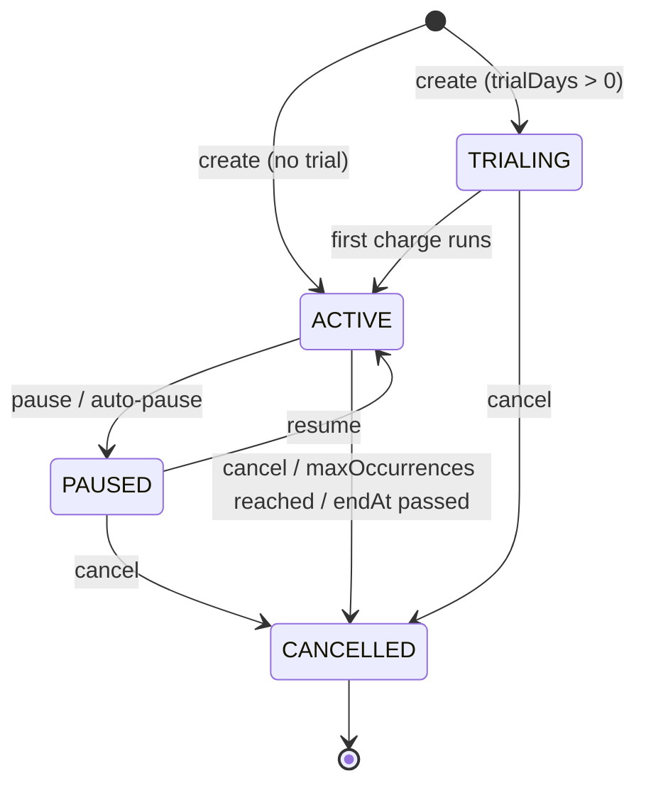

# Recurring Payments

The recurring-payments module lets a merchant create a plan that automatically
generates a new payment on a fixed interval (daily, weekly, or monthly),
reusing the normal payment creation, fee/split, and webhook lifecycle for each
charge.

All endpoints require authentication (JWT) and are scoped to the authenticated
user (`createdBy`).

## Plan fields

| Field | Type | Description |
| --- | --- | --- |
| `id` | uuid | Plan identifier |
| `amount` | decimal(10,2) | Amount charged on each run (min `0.01`) |
| `currency` | string | ISO 4217 code, must be supported by the instance |
| `interval` | enum | `daily`, `weekly`, or `monthly` |
| `status` | enum | `active`, `trialing`, `paused`, or `cancelled` |
| `description` | string | Optional description applied to each generated payment |
| `merchantId` / `merchantEmail` | string | Merchant identity and notification email |
| `payerEmail` | string | Payer email for pre-charge reminders |
| `callbackUrl` | string | Webhook URL applied to each generated payment |
| `metadata` | object | Arbitrary key-value metadata applied to each payment |
| `createdBy` | string | Owning user id |
| `nextRunAt` | timestamp | When the next charge is scheduled |
| `trialDays` / `trialEndsAt` | int / timestamp | Free-trial configuration |
| `lastRunAt` | timestamp | When the last charge ran |
| `endAt` | timestamp | Optional cutoff; plan auto-cancels once the next run would exceed it |
| `maxOccurrences` | int | Optional max successful charges before auto-cancel |
| `occurrences` | int | Successful charges so far |
| `consecutiveFailures` | int | Consecutive failed charges (drives auto-pause) |
| `notifyDaysBefore` | int | Days before each charge to email the payer (`0` disables) |
| `cancelledAt` | timestamp | When the plan was cancelled |

## Supported intervals

| Interval | Next run |
| --- | --- |
| `daily` | +1 day |
| `weekly` | +7 days |
| `monthly` | +1 month |

## Lifecycle



Notes:

- A plan created with `trialDays > 0` starts in `trialing` and transitions to
  `active` when its first charge runs.
- `pause` requires `active`; `resume` requires `paused`; `cancel` fails if the
  plan is already `cancelled`. Otherwise the service throws a `409 Conflict`.
- There is no separate "completed" status: when `maxOccurrences` is reached or
  the next run would pass `endAt`, the plan is set to `cancelled`.

## Auto-pause on repeated failures

When a scheduled charge fails, `consecutiveFailures` is incremented. Once it
reaches `RECURRING_PAYMENT_AUTO_PAUSE_FAILURES` (default `3`), the plan is
automatically set to `paused` and a pause notification is dispatched to the
merchant. A successful charge resets `consecutiveFailures` to `0`.

## Endpoints

All paths are prefixed with `/v1/recurring-payments`. Authenticated requests
carry `Authorization: Bearer <JWT>`.

### `POST /v1/recurring-payments` — Create a plan

```bash
curl -X POST https://api.example.com/v1/recurring-payments \
  -H "Authorization: Bearer $TOKEN" \
  -H "Content-Type: application/json" \
  -d '{
        "amount": 29.99,
        "currency": "USD",
        "interval": "monthly",
        "description": "Monthly subscription",
        "payerEmail": "payer@example.com",
        "callbackUrl": "https://merchant.example.com/webhooks/payment",
        "maxOccurrences": 12
      }'
```

Returns `201 Created` with the created plan. `endAt` must be in the future
(`400` otherwise).

### `GET /v1/recurring-payments` — List plans

```bash
curl -H "Authorization: Bearer $TOKEN" \
  https://api.example.com/v1/recurring-payments
```

Returns all plans owned by the caller, ordered by `createdAt` descending.

### `GET /v1/recurring-payments/:id` — Get a plan

```bash
curl -H "Authorization: Bearer $TOKEN" \
  https://api.example.com/v1/recurring-payments/<id>
```

Returns the plan, or `404` if not found or not owned by the caller.

### `GET /v1/recurring-payments/:id/charges` — List charge attempts

```bash
curl -H "Authorization: Bearer $TOKEN" \
  "https://api.example.com/v1/recurring-payments/<id>/charges?page=1&limit=20"
```

Returns a paginated list of charge attempts in chronological order, including
failed attempts and their `failureReason`.

### `PATCH /v1/recurring-payments/:id` — Update a plan

```bash
curl -X PATCH https://api.example.com/v1/recurring-payments/<id> \
  -H "Authorization: Bearer $TOKEN" \
  -H "Content-Type: application/json" \
  -d '{"amount": 34.99, "interval": "monthly"}'
```

Updates `amount`, `interval`, and/or `description`. Changes apply to future
runs only; already-created payments are unaffected.

### `POST /v1/recurring-payments/:id/pause` — Pause a plan

```bash
curl -X POST https://api.example.com/v1/recurring-payments/<id>/pause \
  -H "Authorization: Bearer $TOKEN"
```

Sets an `active` plan to `paused`. Returns `409` if the plan is not `active`.

### `POST /v1/recurring-payments/:id/resume` — Resume a plan

```bash
curl -X POST https://api.example.com/v1/recurring-payments/<id>/resume \
  -H "Authorization: Bearer $TOKEN"
```

Sets a `paused` plan back to `active` and, if the next run is in the past,
reschedules it for now. Returns `409` if the plan is not `paused`.

### `POST /v1/recurring-payments/:id/cancel` — Cancel a plan

```bash
curl -X POST https://api.example.com/v1/recurring-payments/<id>/cancel \
  -H "Authorization: Bearer $TOKEN"
```

Sets the plan to `cancelled` and records `cancelledAt`. Returns `409` if the
plan is already `cancelled`.

## Notifications and webhooks

- **Payer reminders** — a daily cron emails the payer `notifyDaysBefore` days
  before each upcoming charge (at most once per cycle, tracked by
  `lastNotifiedCycle`).
- **Trial ending** — when a trial is within 3 days of ending, a
  `recurring.trial_ending` webhook is dispatched to the merchant.
- **Auto-pause** — when a plan auto-pauses after repeated failures, the
  merchant is notified.

## Related files

- `src/modules/payments/recurring-payments.controller.ts`
- `src/modules/payments/recurring-payments.service.ts`
- `src/modules/payments/recurring-payment.entity.ts`
- `src/modules/payments/recurring-payment-charge.entity.ts`
- `src/modules/payments/dto/create-recurring-payment.dto.ts`
- `src/modules/payments/dto/update-recurring-payment.dto.ts`
